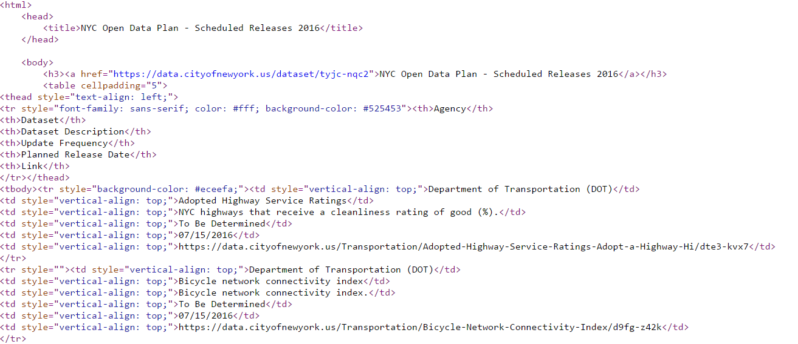
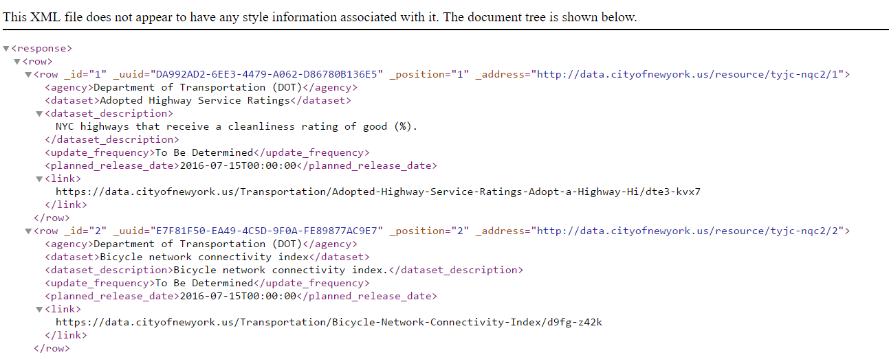
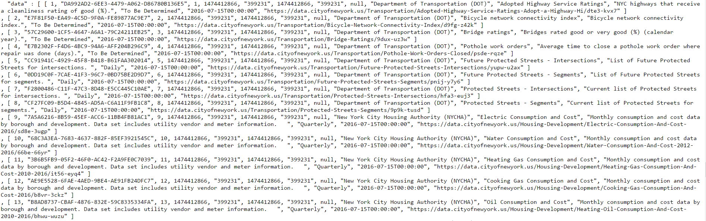

###DATA607-Week07-Homework

Libraries used
```{r, echo=T, warning=F, message=F}
library(knitr)
library(dplyr)
library(rvest)
library(stringr)
library(jsonlite)
library(tibble)
```

In this assignment, we will loading data from 3 different data files. Data files are downloaded from [*NYC Open Data Plan - Scheduled Releases 2016.*](https://data.cityofnewyork.us/d/tyjc-nqc2) This inventory includes all datasets scheduled for release between July 2016 and December 31, 2018. Additional information can be found at https://data.cityofnewyork.us/City-Government/NYC-Open-Data-Plan-Scheduled-Releases-2016/tyjc-nqc2.

```{r , echo=F}
nyclink.data <- data.frame(matrix(ncol = 2, nrow = 1))

nyclink.data <- rbind(nyclink.data, c("HTML","https://data.cityofnewyork.us/api/views/tyjc-nqc2/rows.html?accessType=DOWNLOAD"))
nyclink.data <- rbind(nyclink.data, c("XML","https://data.cityofnewyork.us/api/views/tyjc-nqc2/rows.xml?accessType=DOWNLOAD"))
nyclink.data <- rbind(nyclink.data, c("JSON","https://data.cityofnewyork.us/api/views/tyjc-nqc2/rows.json?accessType=DOWNLOAD"))
nyclink.data <- rbind(nyclink.data, c("Meta Data","https://data.cityofnewyork.us/City-Government/NYC-Open-Data-Plan-Scheduled-Releases-2016/tyjc-nqc2"))

nyclink.data <- nyclink.data %>% 
  na.omit() %>%
  select (X1,X2)

row.names(nyclink.data) <- NULL

kable(nyclink.data, format="pandoc", align="l", col.names = c("File Type","Link"), row.names = NA)
```

####HTML Files

Processing HTML files. We will be using rvest package and [*NYC Open Data Plan - Scheduled Releases 2016.*](https://data.cityofnewyork.us/api/views/tyjc-nqc2/rows.html) dataset. As HTML pages are designed to display data on web pages, actual data is wrapped around formatting tags.



```{r, echo=T}
#Read data from website
nyc.html.raw.data <- read_html("https://data.cityofnewyork.us/api/views/tyjc-nqc2/rows.html")

#In case file is downloaded and saved to local drive. It can also be read from local drive same was it is read from website.
#nyc.html.raw.data <- read_html(paste(getwd(),"//rows.html",sep=""))

#Extract nodes information
nyc.html.nodes <- nyc.html.raw.data %>% 
      html_nodes("tr")

#Extract data from each node
nyc.html.text <- nyc.html.nodes %>% 
  html_text()

#Data needs some tidying as it contains (\n) characters. Replace (\n) with pipe delimited.
nyc.html.text <- gsub(pattern = "\\n", replacement = "|", nyc.html.text)

#First row is column heading. Remove the row
nyc.html.text <- nyc.html.text[2:length(nyc.html.text)]

#Convert dataset into data frame
nyc.html.data.frame <- data.frame(unlist(str_split_fixed(nyc.html.text, "\\|", 7)), stringsAsFactors = F)

#Remove unused columns
nyc.html.data.frame$X7 <- NULL

#Rename the columns names accordingly
nyc.html.data.frame <- rename(nyc.html.data.frame, agency = X1, dataset = X2, dataset_description = X3, update_frequency = X4, planned_release_date = X5, urlLink = X6)

nyc.html.data.frame <- nyc.html.data.frame %>% mutate(cid = row_number())

#Display data
nyc.html.data.frame %>% filter(cid < 16) %>% select(cid, agency, dataset, dataset_description, update_frequency, planned_release_date, urlLink) %>% 
kable(format="pandoc")

```

Next, exercise shows how to extract attributes and values from particular node. Then combine them together as one row.
```{r, echo=T}
#Extracting node that contain hyperlink. Node h3 contains hyperlink.
nyc.hyperlink.raw.data <- nyc.html.raw.data %>% 
      html_nodes("h3")

#Get child node. Node <a> contain hyperlink as attribute and text data as value. In our case we only have one node.
nyc.hyperlink.node.data <- html_nodes(nyc.hyperlink.raw.data[1], "a")

#Get attribute value and and text values using a function
attributes_text <- function(x){
  a <- html_attrs(x)
  t <- html_text(x)
  
  #Tidy attribute values  
  a <- gsub("\\n","",a)
  a <- gsub("\\t","",a)
  a <- gsub("href","",a)
  a <- unlist(a)
  #When node contain more than one attriutes combine them into single value
  a <- paste(a,collapse="|")
  
  #Tidy text values 
  t <- gsub("\\n","",t)
  t <- gsub("\\t","",t)
  t <- gsub("href","",t)
  t <- unlist(t)
  #When node contain more than one text values combine them into single value
  t<-paste(t,collapse="|")
  
  final<-c(t,a)
  final<-unlist(final)
  #Combine attributes and text values
  final<-paste(final,collapse="|")
  return(final)
}

#Display information
nyc.hyperlink.node.data
nyc.hyperlink.node.data %>% 
  html_text()
nyc.hyperlink.node.data %>% 
  html_attrs()

#Attribute and text combined(pipe delimited)
single_row<-attributes_text(nyc.hyperlink.node.data[1])
single_row
```

####XML files
Processing XML files. We will be using rvest package and [*NYC Open Data Plan - Scheduled Releases 2016.*](https://data.cityofnewyork.us/api/views/tyjc-nqc2/rows.xml) dataset. XML files are data files, data can be found as attributes or text values. If we look at 3 and 4 lines from image below, 3^rd^ line contains attributes of data wrapped between tags <row ...></row>. Whereas, line 4 is variable information that is part of <row ...></row>.



```{r, echo=T}
#Read data from website
nyc.xml.raw.data <- read_html("https://data.cityofnewyork.us/api/views/tyjc-nqc2/rows.xml")

#In case file is downloaded and saved to local drive. It can also be read from local drive same was it is read from website.
#nyc.xml.raw.data <- read_html(paste(getwd(),"//rows.xml",sep=""))

#Extract nodes information
nyc.xml.nodes <- nyc.xml.raw.data %>% 
      html_nodes(xpath = "//row//row")

nyc.xml.data.frame <- data.frame(
  agency = nyc.xml.nodes %>%  html_nodes(xpath = "//agency") %>% html_text(),
  dataset = nyc.xml.nodes %>%  html_nodes(xpath = "//dataset") %>% html_text(),
  dataset_description = nyc.xml.nodes %>%  html_nodes(xpath = "//dataset_description") %>% html_text(),
  update_frequency = nyc.xml.nodes %>%  html_nodes(xpath = "//update_frequency") %>% html_text(),
  planned_release_date = nyc.xml.nodes %>%  html_nodes(xpath = "//planned_release_date") %>% html_text(),
  cid = nyc.xml.nodes %>% html_attr("_id") %>% as.integer(),
  stringsAsFactors = F
  )

#Link for the dataset
#Not all datasets have links
#Initiate an empty data frame
nyc.xml.url.frame <- data.frame(cid = NA, urlLink = NA)
for (i in 1:length(nyc.xml.nodes)){
    
    # Get node Id info
    nodeId <-html_attr(nyc.xml.nodes[i], "_id") %>% as.integer()
    
    #Get Url Info
    allText <- nyc.xml.nodes[i] %>% html_text()
    url_pattern <- "http[s]?://(?:[a-zA-Z]|[0-9]|[$-_@.&+]|[!*\\(\\),]|(?:%[0-9a-fA-F][0-9a-fA-F]))+"
    dataSetUrl <- str_extract(allText, url_pattern)
    
    #Load data into data frame
    nyc.xml.url.frame <- rbind(nyc.xml.url.frame, c(nodeId,dataSetUrl))
}

nyc.xml.url.frame <- nyc.xml.url.frame %>% filter(!is.na(cid)) %>% select(cid,urlLink)
nyc.xml.url.frame$cid <- as.numeric(nyc.xml.url.frame$cid)

nyc.xml.complete.data <- nyc.xml.data.frame %>% 
  inner_join(nyc.xml.url.frame, by = "cid") %>% 
  arrange(cid)

#Display data
nyc.xml.complete.data %>% filter(cid < 16) %>% select(cid, agency, dataset, dataset_description, update_frequency, planned_release_date, urlLink) %>% 
kable(format="pandoc")

```

####JSON files
Processing JSON files. We will be using jsonlite package and [*NYC Open Data Plan - Scheduled Releases 2016.*](https://data.cityofnewyork.us/api/views/tyjc-nqc2/rows.json) dataset. JSON files are data files, data can be found as attributes or text values.



```{r, echo=T}
#JSON data from website
nyc.json.raw.data <- fromJSON("https://data.cityofnewyork.us/api/views/tyjc-nqc2/rows.json", flatten = T)

#In case file is downloaded and saved to local drive. It can also be read from local drive same was it is read from website.
#nyc.json.raw.data <- read_html(paste(getwd(),"//rows.json",sep=""))

#Load data into data frame
nyc.json.data.frame <- data.frame(nyc.json.raw.data[['data']])

#Metadata for the JSON data 
nyc.json.meta.data <- nyc.json.raw.data[['meta']]

#Rename column names
nyc.json.data.frame <- nyc.json.data.frame %>% select(cid = X1, agency = X9, dataset = X10, dataset_description = X11, update_frequency = X12, planned_release_date = X13, urlLink = X14)

nyc.json.data.frame$cid <- as.numeric(as.character(nyc.json.data.frame$cid))

#Display data
nyc.json.data.frame %>% filter(cid < 16) %>% select(cid, agency, dataset, dataset_description, update_frequency, planned_release_date, urlLink) %>% 
kable(format="pandoc")
```


####References

- https://github.com/hadley/rvest/issues/12

- http://stackoverflow.com/questions/26496538/extract-urls-with-regex-into-a-new-data-frame-column

- https://blog.exploratory.io/working-with-json-data-in-very-simple-way-ad7ebcc0bb89#.w0pejw8v6

- http://zevross.com/blog/2015/02/12/using-r-to-download-and-parse-json-an-example-using-data-from-an-open-data-portal
